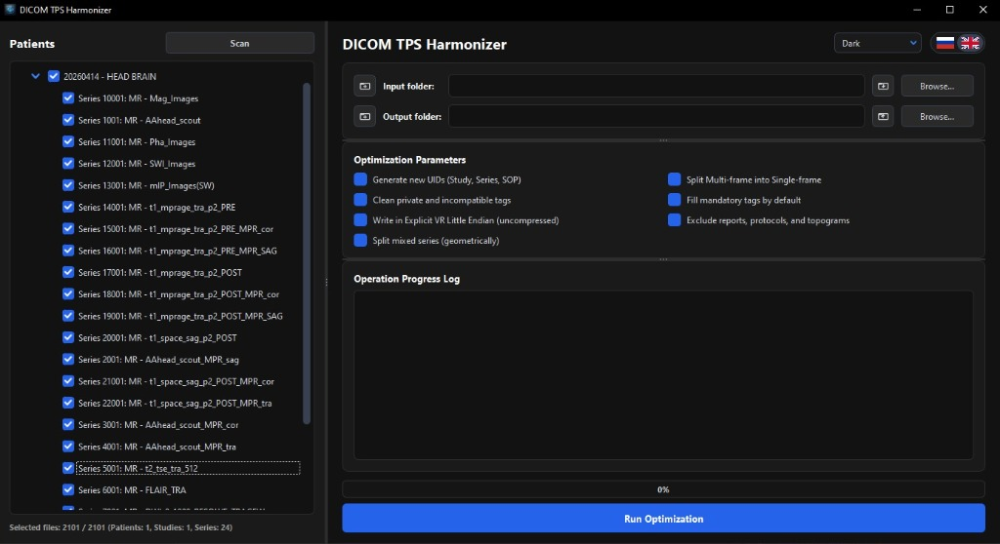
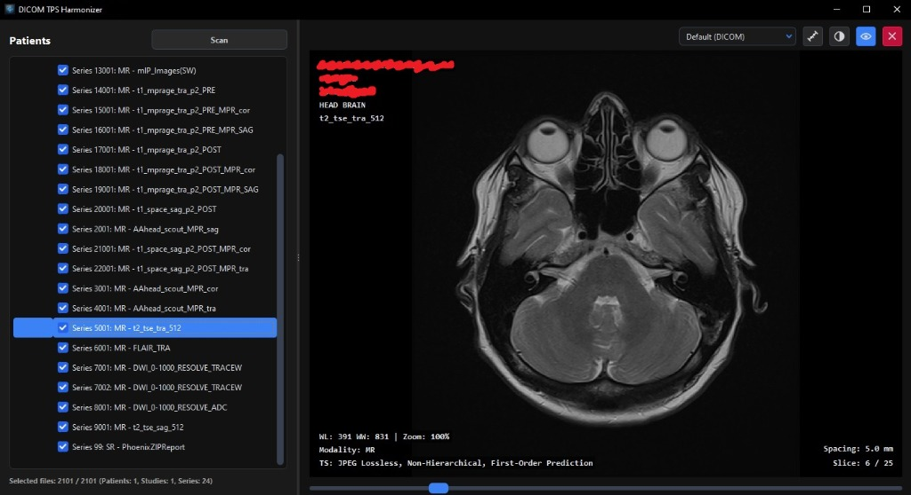
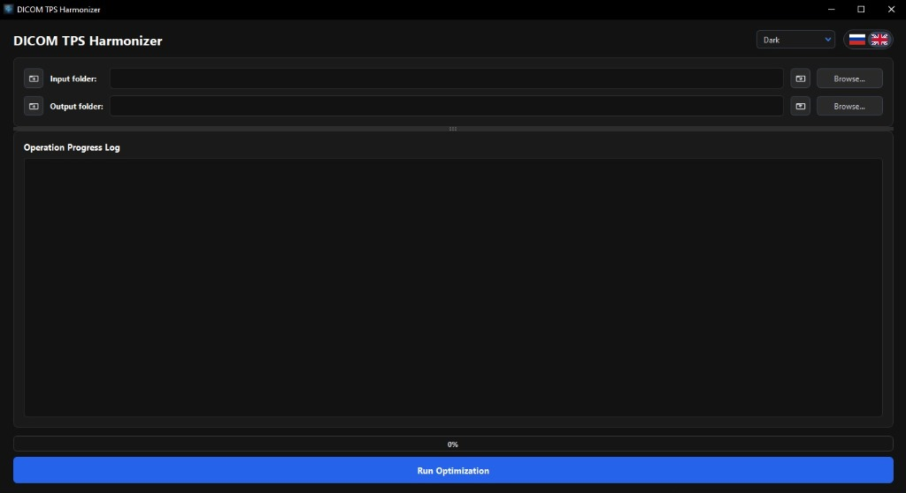

# DICOM TPS Harmonizer

[Русский](#русский) | [English](#english)

---

  
<b>DICOM Viewer Screenshot (Интерактивный вьюер)</b>

   
  

  
<b>Interface Customization (Кастомизация интерфейса / Темы)</b>

   
  

---

## Русский

**DICOM TPS Harmonizer** — это приложение с графическим интерфейсом (GUI) для разделения мультифреймовых DICOM-файлов на одиночные срезы и оптимизации их метаданных под планирующие системы (TPS) **Varian Eclipse** и **Elekta Monaco**.

### Основные возможности
* **Разделение мультифреймов:** Преобразует файлы Enhanced DICOM в классические single-frame срезы.
* **Совместимость с TPS:** Очищает приватные теги, генерирует новые UID и приводит файлы к стандарту, необходимому для Eclipse и Monaco.
* **Автоматическое исправление (Siemens EOF Fix):** На лету восстанавливает поврежденные файлы, у которых отсутствует концевой маркер последовательности пикселей.
* **Удобная структура папок:** Группирует результаты в виде:  
  `Dicom_output / <Имя_Пациента>_<ID_Пациента> / <Модальность_Описание_Серии> / slice_XXXX.dcm`
* **Интерактивный DICOM вьюер:** Встроенный инструмент просмотра серий с поддержкой масштабирования (Zoom), перемещения (Pan), измерительной линейки и тонкой настройки Hounsfield Units (HU) через слайдеры панели управления.
* **Drag-and-Drop:** Удобный импорт путей перетаскиванием файлов или папок прямо в поля ввода.
* **Кастомизация дизайна:** Выбор из 5 встроенных цветовых тем («Темная», «Светлая», «Красная», «Закат» и «Кибер») с динамической адаптацией Windows DWM-заголовков.
* **Современный GUI:** Премиальный интерфейс на базе `PyQt6` с автоподбором размеров проводника пациентов и цветовым логированием в реальном времени.
* **Мультиязычность:** Встроенная поддержка русского и английского языков для интерфейса и логов процессора.

### Использование готовой сборки
Вы можете скачать уже собранный исполняемый файл `.exe` для Windows из раздела [Releases](https://github.com/Flacozyabra/DICOM_TPS_Harmonizer/releases) на GitHub. Он не требует установки Python или каких-либо зависимостей.

### Быстрый запуск из исходников (Windows)
Просто запустите файл [run.bat](run.bat) в корневой папке проекта. Он автоматически активирует виртуальное окружение и запустит программу.

### Установка вручную
1. Создайте виртуальное окружение: `python -m venv .venv`
2. Активируйте его: `.venv\Scripts\activate` (Windows) или `source .venv/bin/activate` (Linux/macOS)
3. Установите зависимости: `pip install -r requirements.txt`
4. Запустите: `python main.py`

---

## English

**DICOM TPS Harmonizer** is a desktop GUI application designed to split multi-frame DICOM files into classic single-frame slices and optimize their metadata for **Varian Eclipse** and **Elekta Monaco** Treatment Planning Systems (TPS).

### Key Features
* **Multi-frame Splitting:** Converts Enhanced DICOM datasets into standard single-frame slices.
* **TPS Compatibility:** Filters incompatible private tags, generates clean UIDs, and standardizes files for Eclipse & Monaco imports.
* **On-the-fly Recovery (Siemens EOF Fix):** Automatically fixes and parses truncated files lacking sequence delimiters.
* **Clear Directory Hierarchy:** Outputs structured patient datasets:  
  `Dicom_output / <PatientName>_<PatientID> / <Modality_SeriesDescription> / slice_XXXX.dcm`
* **Interactive DICOM Viewer:** Integrated series visualization featuring Zoom, Pan, measurement ruler, and HU window Level/Width sliders.
* **Drag-and-Drop Support:** Drag folders or files directly into path input fields.
* **UI Customization:** Choose between 5 built-in color themes ("Dark", "Light", "Red", "Sunset", and "Cyber") with native Windows DWM title bar adaptation.
* **Modern GUI:** Sleek interface built with `PyQt6`, featuring automatic patient explorer resizing and real-time color logging.
* **Multi-language support:** Built-in Russian and English localizations for both GUI and execution logs.

### Using pre-built binaries
You can download the compiled standalone `.exe` for Windows from the [Releases](https://github.com/Flacozyabra/DICOM_TPS_Harmonizer/releases) section. No Python installation or manual dependencies configuration is required.

### Quick Start from source (Windows)
Double-click [run.bat](run.bat) in the project folder. It will configure the virtual environment and start the application automatically.

### Manual Installation
1. Create virtual environment: `python -m venv .venv`
2. Activate it: `.venv\Scripts\activate` (Windows) or `source .venv/bin/activate` (Linux/macOS)
3. Install dependencies: `pip install -r requirements.txt`
4. Launch the app: `python main.py`
